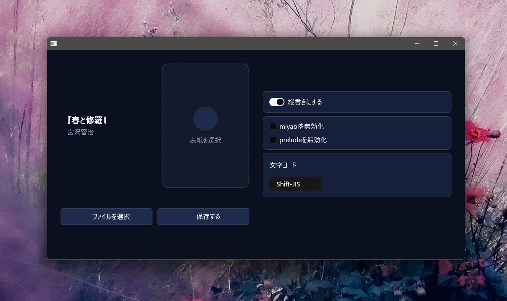
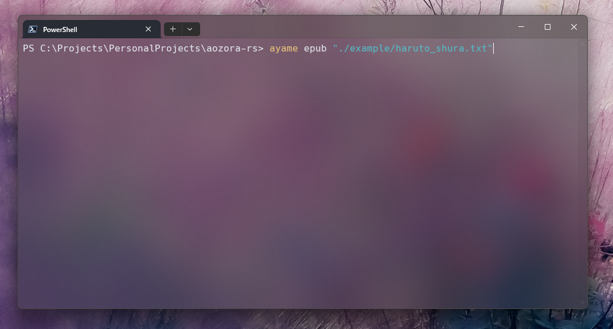

# ayame
ライブラリとしてのaozora-rsに対し、ツールとしてのブランドです。GUI版、CLIを用意しています。

## GUI版



## インストール

**cargoからインストール**

```bash
cargo install --git https://github.com/kinoko0518/aozora-rs ayame-app
```

**コンパイル済みバイナリをダウンロード**

<div align="center">
    <a href="https://github.com/kinoko0518/aozora-rs/releases/latest/download/ayame-app-windows-x86_64.exe">
        <picture>
            <source media="(prefers-color-scheme: dark)" srcset="../docs/images/icons/windows-in-dark.svg">
            <source media="(prefers-color-scheme: light)" srcset="../docs/images/icons/windows-in-light.svg">
            
        </picture>
    </a>
    <a href="https://github.com/kinoko0518/aozora-rs/releases/latest/download/ayame-app-linux-x86_64">
        <picture>
            <source media="(prefers-color-scheme: dark)" srcset="../docs/images/icons/linux-in-dark.svg">
            <source media="(prefers-color-scheme: light)" srcset="../docs/images/icons/linux-in-light.svg">
            
        </picture>
    </a>
    <a href="https://github.com/kinoko0518/aozora-rs/releases/latest/download/ayame-app-macos-aarch64">
        <picture>
            <source media="(prefers-color-scheme: dark)" srcset="../docs/images/icons/mac-in-dark.svg">
            <source media="(prefers-color-scheme: light)" srcset="../docs/images/icons/mac-in-light.svg">
            
        </picture>
    </a>
</div>

## CLI版



### インストール

**cargoからインストール**

```bash
cargo install --git https://github.com/kinoko0518/aozora-rs ayame-cli
```

**コンパイル済みバイナリをダウンロード**

<div align="center">
    <a href="https://github.com/kinoko0518/aozora-rs/releases/latest/download/ayame-cli-windows-x86_64.exe">
        <picture>
            <source media="(prefers-color-scheme: dark)" srcset="../docs/images/icons/windows-in-dark.svg">
            <source media="(prefers-color-scheme: light)" srcset="../docs/images/icons/windows-in-light.svg">
            
        </picture>
    </a>
    <a href="https://github.com/kinoko0518/aozora-rs/releases/latest/download/ayame-cli-linux-x86_64">
        <picture>
            <source media="(prefers-color-scheme: dark)" srcset="../docs/images/icons/linux-in-dark.svg">
            <source media="(prefers-color-scheme: light)" srcset="../docs/images/icons/linux-in-light.svg">
            
        </picture>
    </a>
    <a href="https://github.com/kinoko0518/aozora-rs/releases/latest/download/ayame-cli-macos-aarch64">
        <picture>
            <source media="(prefers-color-scheme: dark)" srcset="../docs/images/icons/mac-in-dark.svg">
            <source media="(prefers-color-scheme: light)" srcset="../docs/images/icons/mac-in-light.svg">
            
        </picture>
    </a>
</div>

### 使い方

```bash
ayame <COMMAND> <SOURCE> [OPTIONS]
```
`<SOURCE>`には.zip、または.txtファイルのパスを受け付けます。

| `<Command>` | 出力フォーマット |
| --- | --- |
| epub | EPUB 3 |
| xhtml | XHTML |

| `[OPTIONS]` | 効果 |
| --- | --- |
| --utf8 | UTF-8としてファイルを解釈します。特に指定しない限りはShift-JISです。 |
| --horizontal | 横書きになります。特に指定しない限りは縦書きです。 | 
| --no-prelude | 要素を正しく表示するための組み込みCSSを無効化します。 |
| --no-miyabi | 美しく表示するための組み込みCSSを無効化します。 |
| --css <FILE_PATH> | 追加のカスタムCSSを適用します。複数回使用できます。 |
| -o, --output <DIR_PATH> | 出力先のディレクトリを指定します。 |
